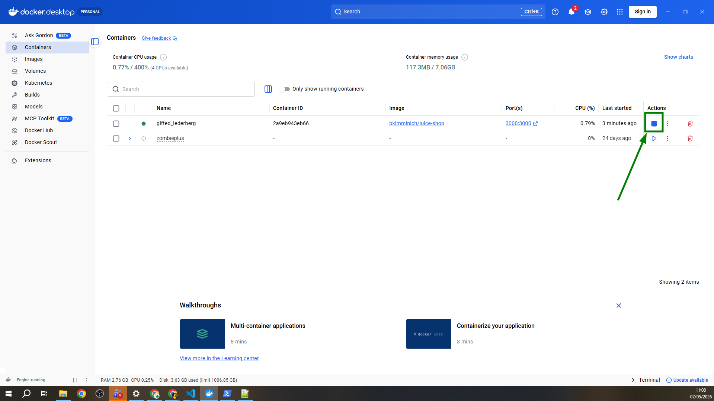

# 🧃 Juice Shop Automation

Automação de testes End-to-End (E2E) da aplicação [OWASP Juice Shop](https://github.com/juice-shop/juice-shop), construída com **Playwright + TypeScript**.

Este projeto faz parte do meu portfólio como QA.

---

## 🧃 Sobre o Juice Shop

O **OWASP Juice Shop** é uma aplicação web propositalmente vulnerável, mantida pela OWASP (Open Worldwide Application Security Project). Apesar de simular uma **loja online de sucos** (com catálogo de produtos, carrinho, login e checkout), seu objetivo real é servir como ambiente de estudo para segurança de aplicações e testes automatizados.

Por que é uma boa escolha para automação de QA:

- **Aplicação web realista**: tem fluxos comuns de e-commerce (login, busca, carrinho, checkout);
- **Estável e pública**: mantida ativamente pela OWASP, sem risco de "quebrar" no meio dos estudos;
- **Roda localmente**: você tem controle total do ambiente, sem depender de servidores externos;
- **Permitida para testes**: diferente de sites reais, automatizar nela não viola termos de uso.

---

## 🎯 Objetivo

Praticar e demonstrar habilidades de automação de testes E2E em uma aplicação web real, aplicando boas práticas como:

- Page Object Model (POM);
- Organização modular de testes;
- Uso de fixtures e hooks do Playwright;
- Seletores robustos e estáveis;
- Relatórios de execução.

---

## 🛠️ Stack

| Ferramenta | Uso |
|---|---|
| [Playwright](https://playwright.dev/) | Framework de automação E2E |
| TypeScript | Linguagem dos testes |
| Node.js | Runtime |
| OWASP Juice Shop | Aplicação sob teste (SUT) |

---

## 📂 Estrutura do projeto

```
juice-shop-automation/
├── tests/              # Casos de teste organizados por funcionalidade
├── pages/              # Page Objects (POM)
├── fixtures/           # Dados e configurações reutilizáveis
├── utils/              # Funções auxiliares
├── playwright.config.ts
├── package.json
└── README.md
```

> A estrutura segue o padrão Page Object Model para separar a lógica dos testes da interação com a UI, facilitando manutenção.

---

## ▶️ Como rodar

### Pré-requisitos

- Node.js 18 ou superior
- [Docker Desktop](https://www.docker.com/products/docker-desktop/) instalado e em execução

### 1. Subindo o Juice Shop com Docker

A forma mais simples de rodar a aplicação é via Docker: não precisa instalar Node.js, banco, nem nada relacionado ao Juice Shop em si.
Abra o terminal do PowerShell como administrado e rode, na seguinte sequência, os comandos abaixo:

```bash
#1 Baixa a imagem oficial mantida pela OWASP
docker pull bkimminich/juice-shop

#2 Sobe o container na porta 3000
docker run --rm -p 3000:3000 bkimminich/juice-shop
```

Pronto! Acesse `http://localhost:3000` no navegador para confirmar que está no ar.

> 💡 **Dica:** você também pode subir/parar o container direto pela interface do Docker Desktop, na aba **Containers**. O botão de "play/stop" facilita bastante quando você só quer rodar os testes rapidamente.


**Comandos úteis:**

```bash
# Roda em segundo plano (libera o terminal)
docker run -d -p 3000:3000 --name juice-shop bkimminich/juice-shop

# Para o container
docker stop juice-shop

# Inicia novamente
docker start juice-shop

# Remove o container
docker rm juice-shop
```

### 2. Instalando o projeto de automação

```bash
# Clone o repositório
git clone https://github.com/raisamrs/juice-shop-automation.git
cd juice-shop-automation

# Instale as dependências
npm install

# Instale os navegadores do Playwright
npx playwright install
```

### Executando os testes

```bash
# Roda todos os testes (modo headless)
npx playwright test

# Roda com interface gráfica (modo headed)
npx playwright test --headed

# Roda em modo debug
npx playwright test --debug

# Roda um teste específico
npx playwright test tests/login.spec.ts

# Abre o modo UI do Playwright
npx playwright test --ui
```

### Visualizando o relatório

```bash
npx playwright show-report
```

---

## ✅ Cenários cobertos

- [x] Cadastro de usuário
- [ ] Login e autenticação
- [ ] Busca de produtos
- [ ] Adição de itens ao carrinho
- [ ] Fluxo de checkout

---

## 📚 O que aprendi

- Estruturação de um projeto de automação do zero com Playwright
- Aplicação prática do padrão Page Object Model em TypeScript
- Estratégias de seletores para reduzir flakiness
- Geração e análise de relatórios de execução

---

## 👤 Autor

**Raisa Moreno** — Analista de QA
[LinkedIn](https://www.linkedin.com/in/raisamrs/) · [Portfólio](https://raisamrs.github.io/)
